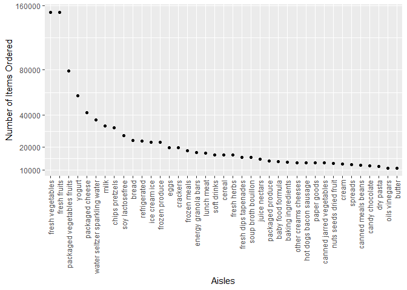
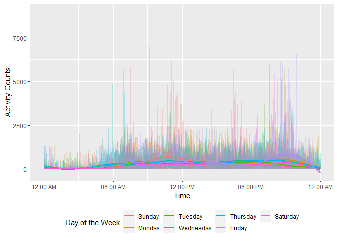
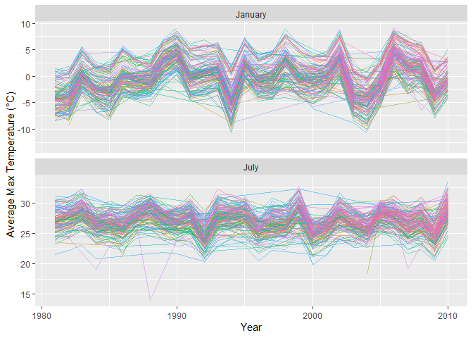
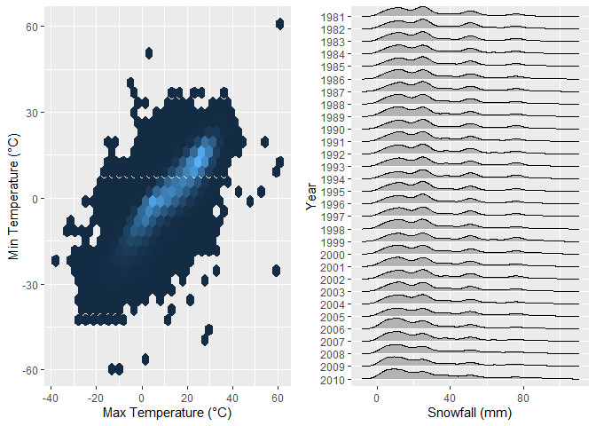

Homework 3
================
Hongjie Liu

Load necessary packages for homework 3.

``` r
library(tidyverse)
library(p8105.datasets)
library(scales)
library(ggridges)
library(gridExtra)
```

## Problem 1

Read the dataset `instacart`.

``` r
data("instacart")
```

Here is a short description of the dataset:

-   The variables of the dataset are
    `order_id, product_id, add_to_cart_order, reordered, user_id, eval_set, order_number, order_dow, order_hour_of_day, days_since_prior_order, product_name, aisle_id, department_id, aisle, department`.
-   The dataset has 1384617 rows (number of observations) and 15
    columns.
-   Some variables’ meaning: `order_dow` indicates the day of the week
    on which the order was placed; `order_hour_of_day` indicates the
    hour of the day on which the order was placed.
    `days_since_prior_order` indicates days since the last order, capped
    at 30, NA if `order_number = 1`; `product_name` indicates name of
    the product; the value of the variable `reordered` is 1 if this
    product has been ordered by this user in the past, 0 otherwise.

``` r
aisles_df = instacart %>% 
  group_by(aisle) %>% 
  summarize(n_obs = n()) %>% 
  mutate(n_ranking = min_rank(desc(n_obs))) %>% 
  arrange(n_ranking)
```

There are 134 aisles, and the aisle “fresh vegetables” is the most items
ordered from.

Make a plot that shows the number of items ordered in each aisle,
limiting this to aisles with more than 10000 items ordered. Arrange
aisles sensibly, and organize your plot so others can read it.

``` r
aisles_df %>% 
  filter(n_obs > 10000) %>% 
  ggplot(aes(x = reorder(aisle, -n_obs), y = n_obs)) +
  geom_col() +
  labs(
    x = "Aisles",
    y = "Number of Items Ordered"
  ) +
  scale_y_continuous(
    breaks = c(10000, 20000, 40000, 80000, 160000),
    trans = "sqrt"
  ) +
  theme(axis.text.x = element_text(angle = 90, vjust = 0.5, hjust = 1))
```

<!-- -->

Make a table showing the three most popular items in each of the aisles
“baking ingredients”, “dog food care”, and “packaged vegetables fruits”.
Include the number of times each item is ordered in your table.

``` r
instacart %>% 
  filter(aisle %in% c("baking ingredients", "dog food care", "packaged vegetables fruits")) %>% 
  group_by(aisle, product_name) %>% 
  summarize(n_obs = n()) %>% 
  filter(min_rank(desc(n_obs)) < 4) %>% 
  arrange(aisle, desc(n_obs)) %>% 
  knitr::kable(caption = "Table 1.1: three most popular items in each of the aisles", col.names = c("Aisle", "Item", "Number of Times Ordered"))
```

| Aisle                      | Item                                          | Number of Times Ordered |
|:---------------------------|:----------------------------------------------|------------------------:|
| baking ingredients         | Light Brown Sugar                             |                     499 |
| baking ingredients         | Pure Baking Soda                              |                     387 |
| baking ingredients         | Cane Sugar                                    |                     336 |
| dog food care              | Snack Sticks Chicken & Rice Recipe Dog Treats |                      30 |
| dog food care              | Organix Chicken & Brown Rice Recipe           |                      28 |
| dog food care              | Small Dog Biscuits                            |                      26 |
| packaged vegetables fruits | Organic Baby Spinach                          |                    9784 |
| packaged vegetables fruits | Organic Raspberries                           |                    5546 |
| packaged vegetables fruits | Organic Blueberries                           |                    4966 |

Table 1.1: three most popular items in each of the aisles

Make a table showing the mean hour of the day at which Pink Lady Apples
and Coffee Ice Cream are ordered on each day of the week; format this
table for human readers (i.e. produce a 2 x 7 table).

``` r
instacart %>% 
  filter(product_name %in% c("Pink Lady Apples", "Coffee Ice Cream")) %>% 
  group_by(product_name, order_dow) %>% 
  summarize(mean_hour = mean(order_hour_of_day)) %>% 
  mutate(
    order_dow = as.character(order_dow),
    order_dow = 
      recode(
        order_dow, 
        "0" = "Sunday",
        "1" = "Monday",
        "2" = "Tuesday",
        "3" = "Wednesday",
        "4" = "Thursday",
        "5" = "Friday",
        "6" = "Saturday"
      )
  ) %>% 
  pivot_wider(
  names_from = "order_dow", 
  values_from = "mean_hour"
  ) %>% 
  rename(Item = product_name) %>% 
  knitr::kable(
    caption = "Table 1.2: mean hour of the day at which items are ordered on each day of the week",
    digit = 1
  )
```

| Item             | Sunday | Monday | Tuesday | Wednesday | Thursday | Friday | Saturday |
|:-----------------|-------:|-------:|--------:|----------:|---------:|-------:|---------:|
| Coffee Ice Cream |   13.8 |   14.3 |    15.4 |      15.3 |     15.2 |   12.3 |     13.8 |
| Pink Lady Apples |   13.4 |   11.4 |    11.7 |      14.2 |     11.6 |   12.8 |     11.9 |

Table 1.2: mean hour of the day at which items are ordered on each day
of the week

## Problem 2

Load, tidy, and otherwise wrangle the data. The final dataset `accel_df`
includes all originally observed variables and values; has useful
variable names; includes a weekday vs weekend variable; and encodes data
with reasonable variable classes.

``` r
accel_df =
  read_csv("./data/accel_data.csv") %>% 
  janitor::clean_names() %>% 
  pivot_longer(
    cols = activity_1:activity_1440,
    names_to = "minute",
    names_prefix = "activity_",
    values_to = "activity_counts"
  ) %>% 
  mutate(
    weekday = ifelse(day %in% c("Saturday", "Sunday"), FALSE, TRUE),
    minute = as.numeric(minute),
    day = factor(day, levels = c("Sunday", "Monday", "Tuesday", "Wednesday", "Thursday", "Friday", "Saturday"))
  )

accel_df
```

    ## # A tibble: 50,400 × 6
    ##     week day_id day    minute activity_counts weekday
    ##    <dbl>  <dbl> <fct>   <dbl>           <dbl> <lgl>  
    ##  1     1      1 Friday      1            88.4 TRUE   
    ##  2     1      1 Friday      2            82.2 TRUE   
    ##  3     1      1 Friday      3            64.4 TRUE   
    ##  4     1      1 Friday      4            70.0 TRUE   
    ##  5     1      1 Friday      5            75.0 TRUE   
    ##  6     1      1 Friday      6            66.3 TRUE   
    ##  7     1      1 Friday      7            53.8 TRUE   
    ##  8     1      1 Friday      8            47.8 TRUE   
    ##  9     1      1 Friday      9            55.5 TRUE   
    ## 10     1      1 Friday     10            43.0 TRUE   
    ## # … with 50,390 more rows

Here is a short description of the resulting dataset `accel_df`:

-   The variables are
    `week, day_id, day, minute, activity_counts, weekday`.
-   The dataset has 50400 rows (number of observations) and 6 columns.

Using the tidied dataset, aggregate across minutes to create a total
activity variable for each day, and create a table showing these totals.

``` r
accel_df %>% 
  group_by(week, day) %>% 
  summarize(total_activity = sum(activity_counts)) %>% 
  pivot_wider(
    names_from = day,
    values_from = total_activity
  ) %>% 
  knitr::kable(caption = "Table 2.1: total activity for each day", digit = 0)
```

| week | Sunday | Monday | Tuesday | Wednesday | Thursday | Friday | Saturday |
|-----:|-------:|-------:|--------:|----------:|---------:|-------:|---------:|
|    1 | 631105 |  78828 |  307094 |    340115 |   355924 | 480543 |   376254 |
|    2 | 422018 | 295431 |  423245 |    440962 |   474048 | 568839 |   607175 |
|    3 | 467052 | 685910 |  381507 |    468869 |   371230 | 467420 |   382928 |
|    4 | 260617 | 409450 |  319568 |    434460 |   340291 | 154049 |     1440 |
|    5 | 138421 | 389080 |  367824 |    445366 |   549658 | 620860 |     1440 |

Table 2.1: total activity for each day

From the table, it seems that there are no apparent trends. Besides, 2
observations (the two Saturdays in week 4 and week 5) have
`total_activity = 1440` with `activity_counts = 1` for each minute, and
they are probably caused by mistake.

Make a single-panel plot that shows the 24-hour activity time courses
for each day and use color to indicate day of the week.

``` r
accel_df %>% 
  mutate(
    time =
      paste(
        as.character(sprintf("%02d", (minute - 1) %/% 60)),
        as.character(sprintf("%02d", (minute - 1) %% 60)),
        sep = ":"
      ) %>% 
      as.POSIXct(format = "%H:%M", tz = "America/New_York")
  ) %>% 
  ggplot(aes(x = time, y = activity_counts, color = day)) +
  geom_line(alpha = .25) +
  geom_smooth(se = FALSE) +
  scale_x_datetime(labels = date_format("%I:%M %p", tz = "America/New_York")) +
  labs(x = "Time", y = "Activity Counts", color = "Day of the Week") +
  theme(legend.position = "bottom")
```

<!-- -->

It seems that activity counts peak on Friday at around 9 pm and on
Saturday at around 10:30 am, and are relatively low between midnight and
dawn (probably sleeping hours).

## Problem 3

Read the dataset `ny_noaa`.

``` r
data("ny_noaa")
```

Here is a description of the dataset `ny_noaa`:

-   The variables of the dataset are
    `id, date, prcp, snow, snwd, tmax, tmin`.
-   The dataset has 2595176 rows (number of observations) and 7 columns.
-   `id` indicates weather station ID; `prcp` indicates precipitation;
    `snow` indicates snowfall; `snwd` indicates snow depth; `tmax` and
    `tmin` indicate max and min temperature respectively.
-   There are 47.1% of the observations contain at least one missing
    value.

Do some data cleaning. Create separate variables for year, month, and
day. Ensure observations for temperature, precipitation, and snowfall
are given in reasonable units. For temperature, the unit is degree
Celsius. For precipitation, the unit is millimeter. For snowfall and
snow depth, the units are centimeter. (we keep the `snow` variable and
add a new variable `snow_cm` for unit changes)

``` r
noaa_df = ny_noaa %>% 
  separate(date, into = c("year", "month", "day"), sep = "-", convert = TRUE) %>% 
  mutate(
    month = month.name[month],
    tmax = as.numeric(tmax),
    tmin = as.numeric(tmin),
    prcp = prcp / 10,
    snow_cm = snow / 10,
    snwd = snwd / 10,
    tmax = tmax / 10,
    tmin = tmin / 10,
  )

mc_value =
  noaa_df %>% 
  drop_na() %>% 
  group_by(snow) %>% 
  summarize(n_obs = n()) %>% 
  mutate(n_ranking = min_rank(desc(n_obs))) %>% 
  arrange(n_ranking) %>% 
  select(snow)
```

For snowfall, the most commonly observed value is 0. I think it’s
because most days of the year do not snow.

Make a two-panel plot showing the average max temperature in January and
in July in each station across years.

``` r
noaa_df %>% 
  filter(month %in% c("January", "July")) %>% 
  group_by(month, id, year) %>% 
  summarize(mean_tmax = mean(tmax)) %>% 
  drop_na() %>% 
  ggplot(aes(x = year, y = mean_tmax, color = id)) +
  geom_line(alpha = .5) +
  geom_smooth(se = FALSE) +
  facet_wrap(. ~ month, ncol = 1,  scales = "free_y") +
  labs(x = "Year", y = "Average Max Temperature (°C)") +
  theme(legend.position = "none")
```

<!-- -->

From the plot, it seems that there is no apparent increasing or
decreasing trend in average max temperature in January and in July.
There is an apparent outlier, which is the average max temperature in
July in 1988 in one station.

Make a two-panel plot showing (i) `tmax` vs `tmin` for the full dataset
(note that a scatterplot may not be the best option); and (ii) make a
plot showing the distribution of snowfall values greater than 0 mm and
less than 100 mm separately by year.

``` r
plot_a =
  ggplot(noaa_df, aes(x = tmax, y = tmin)) +
  geom_hex() +
  labs(x = "Max Temperature (°C)", y = "Min Temperature (°C)") +
  theme(legend.position = "none")

plot_b =
  noaa_df %>% 
  filter(
    snow > 0,
    snow < 100
  ) %>% 
  mutate(year = as.character(year)) %>% 
  ggplot(aes(x = snow, y = year)) +
  geom_density_ridges(scale = .85) +
  scale_y_discrete(limits = rev) +
  labs(x = "Snowfall (mm)", y = "Year")

grid.arrange(plot_a, plot_b, ncol = 2)
```

<!-- -->
