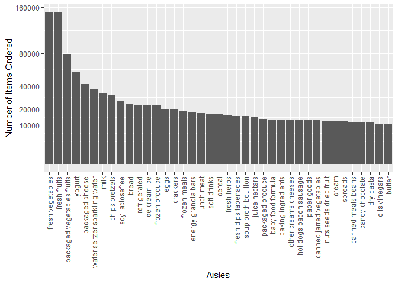

Homework 3
================
Hongjie Liu

Load necessary packages for homework 3.

``` r
library(tidyverse)
library(p8105.datasets)
```

## Problem 1

Read the dataset `instacart`.

``` r
data("instacart")
```

Here is a short description of the dataset:

-   The variables of the dataset are
    `order_id, product_id, add_to_cart_order, reordered, user_id, eval_set, order_number, order_dow, order_hour_of_day, days_since_prior_order, product_name, aisle_id, department_id, aisle, department`.
-   The dataset has 1384617 rows (number of observations) and 15
    columns.
-   Some variables’ meaning: `order_dow` indicates the day of the week
    on which the order was placed; `order_hour_of_day` indicates the
    hour of the day on which the order was placed.
    `days_since_prior_order` indicates days since the last order, capped
    at 30, NA if `order_number = 1`; `product_name` indicates name of
    the product; the value of the variable `reordered` is 1 if this
    product has been ordered by this user in the past, 0 otherwise.

``` r
aisles_df = instacart %>% 
  group_by(aisle) %>% 
  summarize(n_obs = n()) %>% 
  mutate(n_ranking = min_rank(desc(n_obs))) %>% 
  arrange(n_ranking)
```

There are 134 aisles, and the aisle “fresh vegetables” is the most items
ordered from.

Make a plot that shows the number of items ordered in each aisle,
limiting this to aisles with more than 10000 items ordered. Arrange
aisles sensibly, and organize your plot so others can read it.

``` r
aisles_df %>% 
  filter(n_obs > 10000) %>% 
  ggplot(aes(x = reorder(aisle, -n_obs), y = n_obs)) +
  geom_col() +
  labs(x = "Aisles",
       y = "Number of Items Ordered") +
  scale_y_continuous(
    breaks = c(10000, 20000, 40000, 80000, 160000),
    trans = "sqrt") +
  theme(axis.text.x = element_text(angle = 90, vjust = 0.5, hjust = 1))
```

<!-- -->

Make a table showing the three most popular items in each of the aisles
“baking ingredients”, “dog food care”, and “packaged vegetables fruits”.
Include the number of times each item is ordered in your table.

``` r
instacart %>% 
  filter(aisle %in% c("baking ingredients", "dog food care", "packaged vegetables fruits")) %>% 
  group_by(aisle, product_name) %>% 
  summarize(n_obs = n()) %>% 
  filter(min_rank(desc(n_obs)) < 4) %>% 
  arrange(aisle, desc(n_obs)) %>% 
  knitr::kable(caption = "Table 1.1", col.names = c("Aisle", "Item", "Number of Times Ordered"))
```

| Aisle                      | Item                                          | Number of Times Ordered |
|:---------------------------|:----------------------------------------------|------------------------:|
| baking ingredients         | Light Brown Sugar                             |                     499 |
| baking ingredients         | Pure Baking Soda                              |                     387 |
| baking ingredients         | Cane Sugar                                    |                     336 |
| dog food care              | Snack Sticks Chicken & Rice Recipe Dog Treats |                      30 |
| dog food care              | Organix Chicken & Brown Rice Recipe           |                      28 |
| dog food care              | Small Dog Biscuits                            |                      26 |
| packaged vegetables fruits | Organic Baby Spinach                          |                    9784 |
| packaged vegetables fruits | Organic Raspberries                           |                    5546 |
| packaged vegetables fruits | Organic Blueberries                           |                    4966 |

Table 1.1

Make a table showing the mean hour of the day at which Pink Lady Apples
and Coffee Ice Cream are ordered on each day of the week; format this
table for human readers (i.e. produce a 2 x 7 table).

``` r
instacart %>% 
  filter(product_name %in% c("Pink Lady Apples", "Coffee Ice Cream")) %>% 
  group_by(product_name, order_dow) %>% 
  summarize(mean_hour = mean(order_hour_of_day)) %>% 
  mutate(
    order_dow = as.character(order_dow),
    order_dow = 
      recode(
        order_dow, 
        "0" = "Sunday",
        "1" = "Monday",
        "2" = "Tuesday",
        "3" = "Wednesday",
        "4" = "Thursday",
        "5" = "Friday",
        "6" = "Saturday"
      )
  ) %>% 
  pivot_wider(
  names_from = "order_dow", 
  values_from = "mean_hour"
  ) %>% 
  rename(Item = product_name) %>% 
  knitr::kable(
    caption = "Table 1.2: mean hour of the day at which items are ordered on each day of the week",
    digit = 1
  )
```

| Item             | Sunday | Monday | Tuesday | Wednesday | Thursday | Friday | Saturday |
|:-----------------|-------:|-------:|--------:|----------:|---------:|-------:|---------:|
| Coffee Ice Cream |   13.8 |   14.3 |    15.4 |      15.3 |     15.2 |   12.3 |     13.8 |
| Pink Lady Apples |   13.4 |   11.4 |    11.7 |      14.2 |     11.6 |   12.8 |     11.9 |

Table 1.2: mean hour of the day at which items are ordered on each day
of the week
